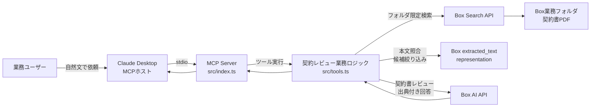
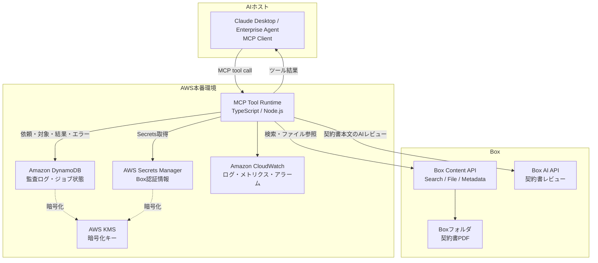

# legal-contract-reviewer

日本語契約書をBox AIで法務レビューする、Claude Desktop向けMCPサーバーです。

Claude DesktopなどのMCPホストから自然文で契約書レビューを依頼し、Box上の契約書PDFを検索し、重大度順のリスク、懸念点、推奨アクション、出典を返します。
Box公式MCPやBox AI APIを置き換えるものではなく、その上に「契約レビュー業務の体験」を載せるリファレンス実装です。

本プロジェクトはポートフォリオ兼リファレンス実装であり、Box公式製品ではありません。

## 何を見せるか

このPoCで見せること：

- Claude DesktopからMCPツールとして契約書レビューを実行できる
- ユーザーはBox file IDやツール引数を意識せず、自然文で依頼できる
- Box上の通常業務フォルダから契約書PDFを検索する
- 候補が1件ならそのままレビュー、複数ならClaudeが候補を提示してユーザーに確認する
- 契約書本文のAIレビューはBox AIで行う
- MCPツールを組み合わせ、抽出、レビュー、ガバナンス確認、メタデータ反映へ拡張できる
- 実顧客に展開する場合のAWS本番アーキテクチャを説明できる

Claude Desktopでの依頼例：

```text
グローバルコマースとの業務委託契約について、受託者側で危ない記載がないかレビューして
```

## 設計の主張

Boxは汎用MCPサーバーとBox AI APIを提供しています。
このプロジェクトは、それらを再実装するものではありません。

狙いは、Boxの上に次のような業務レイヤーを作ることです。

- 契約書レビューに特化したプロンプト
- 委託者、受託者というレビュー立場の切り替え
- 自然文からの契約書検索
- AIホストによるツール選択とツール連携
- 監査ログ、メタデータ、コメント記録への拡張
- 本番運用時のAWSセキュリティ設計

MCPに絞る理由：

```text
AIホストがユーザー意図を解釈し、必要なツールを自律的に選び、複数の操作を組み合わせる。
```

この価値を見せるため、入口はClaude DesktopなどのMCPホストに統一します。

## データ境界

データ境界の表現は正確に置きます。

```text
契約書本文を外部LLMへ渡さない。
契約書本文のAIレビューはBox AIで行う。
MCPサーバーには、検索語、ファイル名、レビュー結果、出典スニペットなど必要な情報だけが渡る。
```

「データが一切Box外に出ない」ではなく、「契約書本文を外部LLMに渡さず、Box AIとBox権限を軸にレビューする」がこのPoCの正確な主張です。

## 現在のPoC構成

現在のデモでは、MCPサーバーをローカルPCで動かします。
Claude DesktopからはstdioでMCPサーバーを起動します。



### 処理フロー

```text
1. Claude Desktopで自然文のレビュー依頼をする
2. ClaudeがMCPツール box_review_contract または box_find_contracts を選ぶ
3. contractQuery に会社名や契約種別を渡す
4. BOX_SEARCH_FOLDER_ID 配下でBox Searchを実行する
5. 候補PDFの本文を取得し、検索語をすべて含むものだけに絞る
6. 候補が1件ならレビュー、複数ならClaudeが候補を提示してユーザーに確認する
7. Box AIに契約レビューを依頼する
8. 重大度順の懸念点、推奨アクション、出典をClaudeに返す
```

## AWS本番リファレンス

実顧客に展開する場合は、MCPツール実行層をAWS上に配置する構成を想定します。
AWSが担うのは、ツール実行、Box連携、監査ログ、秘密情報管理、監視です。
契約書本文のレビューは引き続きBox AIを中心にします。

### 本番構成図



### 本番の流れ

```text
AIホスト
  → MCPツール呼び出し
  → AWS上のMCP Tool Runtime
  → Box Search / Box AI
  → DynamoDBに監査ログ
  → AIホストへ結果返却
```

Box上のファイル追加・更新を起点に事前処理する場合は、Box Webhookでメタデータ更新や検索補助情報の整備を行う構成も拡張案になります。
ただし、ユーザー操作の入口はMCPホストに置きます。

### AWSセキュリティ設計

実運用で重視する点：

- Box認証情報はSecrets Managerで管理
- 実行ロールは必要なSecret、DynamoDBテーブル、CloudWatch Logsだけに絞る
- DynamoDB、Secrets Manager、CloudWatch LogsはKMSで暗号化
- 必要に応じて実行環境をVPC内のプライベートサブネットで動かす
- Box APIへの外向き通信はNAT Gatewayまたは制御されたegress経由にする
- DynamoDBには契約書本文を保存しない
- 監査ログは依頼者、対象ファイル、実行時刻、ステータス、エラー、処理時間を中心に保存する

監査ログの例：

```json
{
  "requestId": "uuid",
  "source": "mcp",
  "userId": "user-or-agent-id",
  "boxFileId": "1234567890",
  "fileName": "sample_risky_contract.pdf",
  "standpoint": "受託者",
  "status": "succeeded",
  "startedAt": "2026-05-31T10:00:00.000Z",
  "finishedAt": "2026-05-31T10:00:08.000Z",
  "citationsCount": 4
}
```

## Bedrockの位置づけ

Bedrockは主役にしません。

このプロジェクトの主張は、契約書本文のレビューをBox AIで行い、Box権限とBox上のファイル管理を軸にすることです。
Bedrockを使う場合は、次のような非機密な補助処理に限定します。

- 検索語の補正
- ツール結果の非機密な整形
- 監査ログの非機密な要約

契約書本文、条文、出典スニペットをBedrockへ渡す場合は、顧客のセキュリティ要件、リージョン、ログ保持、モデル利用ポリシーを別途設計する必要があります。
このPoCの推奨構成では、契約書本文の読解はBox AIに寄せます。

## 主なMCPツール

| ツール | 内容 | 使うBox機能 |
|------|------|-----------|
| `box_review_contract` | 日本語契約書を法務観点でレビュー。重大度順の懸念点、推奨アクション、出典を返す | Box AI `/ai/ask` |
| `box_find_contracts` | 会社名や契約種別などの自然文から、Box上の契約書PDF候補を検索する | Box Search API + extracted_text |
| `box_extract_contract` | 契約相手方、期間、自動更新、解約予告、金額、準拠法などを構造化抽出 | Box AI `/ai/extract_structured` |
| `box_governance_scan` | PII・機密情報を検出し、リスクバンドに集約 | Boxテキスト表現 + ポリシールール |
| `box_writeback_metadata` | 抽出・判定結果をエンタープライズメタデータとして書き戻し | Box Metadata API |
| `box_post_summary_comment` | レビュー要約をBoxファイルのコメントとして残す | Box Comments API |
| `box_ai_ask` | Box内のファイルを根拠に、出典付きで質問応答 | Box AI `/ai/ask` |

## パフォーマンス方針

現在の自然文検索は次の順序で動きます。

```text
Box Search
  → 上位候補を取得
  → PDF本文を取得
  → 入力語をすべて含む候補だけ残す
```

全PDFを総当たりするのではなく、Box Searchの上位候補だけ本文照合します。
ただし、対象フォルダや候補数が大きくなると遅くなる可能性があります。

本番では次を優先します。

- `BOX_SEARCH_FOLDER_ID` で検索対象を業務フォルダに限定
- 契約相手方、契約種別、締結日などをBox Metadata化
- メタデータ検索を優先し、本文検索は補助にする
- Box Webhookでファイル追加・更新イベントを拾い、事前に検索補助情報を整える
- PDF本文や検索結果の短時間キャッシュを検討

## セットアップ

### 1. Boxアプリを作成

1. Box Developer ConsoleでCustom Appを作成
2. 認証方式を選択
   - 短時間デモ：Developer Token
   - 継続利用：Client Credentials Grant（CCG）
3. 必要なスコープを有効化
   - ファイル読み取り
   - Box AI
   - メタデータ
   - コメント

### 2. 環境変数を設定

```bash
cp .env.template .env
```

CCGで動かす場合：

```bash
BOX_CLIENT_ID=
BOX_CLIENT_SECRET=
BOX_ENTERPRISE_ID=
```

自然文検索の対象フォルダを限定する場合：

```bash
BOX_SEARCH_FOLDER_ID=
```

`BOX_SEARCH_FOLDER_ID` には、業務ユーザーが普段使うBoxフォルダのIDを設定します。
そのフォルダをBoxサービスアカウントに共有しておくと、専用フォルダにファイルをコピーせずにデモできます。

### 3. ビルド

```bash
npm install
npm run build
```

### 4. MCPサーバーとして起動

```bash
npm start
```

Claude DesktopなどのMCPホストから使う場合は、`dist/index.js` をMCP設定に登録します。

設定例：

```json
{
  "mcpServers": {
    "legal-contract-reviewer": {
      "command": "node",
      "args": ["/ABSOLUTE/PATH/TO/legal-contract-reviewer/dist/index.js"],
      "env": {
        "BOX_ENV_PATH": "/ABSOLUTE/PATH/TO/legal-contract-reviewer/.env"
      }
    }
  }
}
```

Claude Desktopでの依頼例：

```text
グローバルコマースとの業務委託契約について、受託者側で危ない記載がないかレビューして
```

## デモ用ファイル

脆弱な条項を意図的に含む `sample_risky_contract.pdf` を、通常のBox画面で見える共有フォルダへ配置します。
業務ユーザーが普段使うBoxフォルダをサービスアカウントに共有する想定です。

## 既知の制約

- 無料Box Developer環境ではas-userが使えない場合があるため、PoCではCCGのサービスアカウント運用
- 本番ではas-userにより、依頼者本人のBox権限に沿った検索・レビューにするのが理想
- `box_governance_scan` のPII検出は正規表現ベースのPoC
- `box_writeback_metadata` はBox Metadata Templateの事前作成が前提
- MCPサーバーに返るレビュー結果と出典スニペットはBox外に出るため、AIホスト側の利用・保存ポリシー設計が必要

## 技術スタック

- TypeScript
- Node.js
- `box-typescript-sdk-gen`
- `@modelcontextprotocol/sdk`
- `zod`
- Box AI API
- Box Content API
- Box Metadata API
