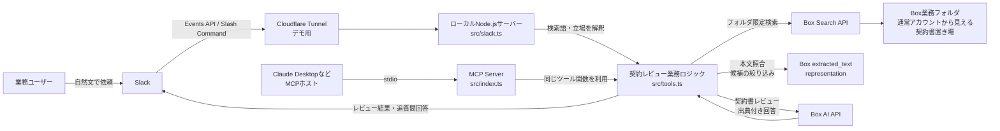
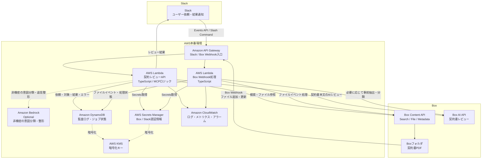

# legal-contract-reviewer

日本語契約書をBox AIで法務レビューする、Box向け業務特化ソリューションのリファレンス実装です。

Slackから自然文で契約書レビューを依頼し、Box上の契約書を検索し、重大度順のリスク、懸念点、推奨アクション、出典を返します。
Box公式MCPやBox AI APIを置き換えるものではなく、その上に「契約レビュー業務の体験」を載せる位置づけです。

本プロジェクトはポートフォリオ兼リファレンス実装であり、Box公式製品ではありません。

## 何を見せるか

このPoCで見せること：

- Slackから自然文で契約書レビューを依頼できる
- ユーザーはMCPツール名、Box file ID、standpoint引数を意識しない
- Box上の通常業務フォルダから契約書PDFを検索する
- 候補が1件なら自動でレビュー開始、複数ならSlackスレッドで番号選択
- レビュー後の同じスレッドで「第一条からいこう」のような追加依頼ができる
- 契約書本文のAIレビューはBox AIで行う
- 実顧客に展開する場合のAWS本番アーキテクチャを説明できる

デモで使う依頼例：

```text
@契約レビューBot グローバルコマースとの業務委託契約、受託者側で危ない記載はある？
```

レビュー後の追質問例：

```text
第一条からいこう
```

## 設計の主張

Boxは汎用MCPサーバーとBox AI APIを提供しています。
このプロジェクトは、それらを再実装するものではありません。

狙いは、Boxの上に次のような業務レイヤーを作ることです。

- 契約書レビューに特化したプロンプト
- 委託者、受託者というレビュー立場の切り替え
- 自然文からの契約書検索
- Slack上での候補選択と追質問
- 監査ログ、メタデータ、コメント記録への拡張
- 本番運用時のAWSセキュリティ設計

データ境界の表現は正確に置きます。

```text
契約書本文を外部LLMへ渡さない。
契約書本文のAIレビューはBox AIで行う。
SlackやAWSには、検索語、ファイル名、レビュー結果、出典スニペットなど必要な情報だけが渡る。
```

「データが一切Box外に出ない」ではなく、「契約書本文を外部LLMに渡さず、Box AIとBox権限を軸にレビューする」がこのPoCの正確な主張です。

## 現在のPoC構成

現在のデモでは、Slack AppとMCPサーバーをローカルPCで動かします。
SlackからのリクエストはCloudflare Tunnelなどでローカルへ転送します。



### PoCの処理フロー

```text
1. Slackで自然文のレビュー依頼を受ける
2. 依頼文からレビュー立場を推定する
   - 受託者、乙側、ベンダーなど → 受託者
   - 委託者、甲側、発注者など → 委託者
3. 依頼文から会社名や契約種別を検索語として取り出す
4. BOX_SEARCH_FOLDER_ID 配下でBox Searchを実行する
5. 候補PDFの本文を取得し、検索語をすべて含むものだけに絞る
6. 候補が1件ならレビュー開始、複数ならSlackスレッドで番号選択
7. Box AIに契約レビューを依頼する
8. 重大度順の懸念点、推奨アクション、出典をSlackに返す
9. 同じスレッドの追加依頼は、同じPDFへの追質問として処理する
```

## AWS本番リファレンス

実顧客に展開する場合は、ローカルPCではなくAWS上で常時稼働させます。
ここでAWSが担うのは、Slack/Boxイベントの受付、業務ロジックの実行、監査ログ、秘密情報管理、監視です。
契約書本文のレビューは引き続きBox AIを中心にします。

### 本番構成図



### 2つの流れ

本番では、Slack起点とBox Webhook起点を分けて考えます。

Slack起点のオンデマンドレビュー：

```text
Slack
  → API Gateway
  → Lambda（契約レビューAPI）
  → Box Search / Box AI
  → DynamoDBに監査ログ
  → Slackへ結果返信
```

Box Webhook起点の事前処理：

```text
Boxで契約書が追加・更新される
  → Box Webhook
  → API Gateway
  → Lambda（Webhook処理）
  → 必要に応じてBox AIで事前抽出・分類
  → メタデータ更新、検索補助情報更新、監査ログ記録
```

Slackのレビュー依頼が来たときに毎回すべてを重く処理するのではなく、Webhookで事前にファイルイベントを拾える構成にしておくと、本番運用に寄せられます。

### Lambdaで動くもの

Lambdaに載せるのは、MCPサーバーそのものというより、現在 `src/tools.ts` にあるMCPツール相当の業務ロジックです。

```text
src/tools.ts
  ├─ reviewContract
  ├─ extractContractFields
  ├─ governanceScan
  ├─ writebackMetadata
  └─ postSummaryComment
```

ローカルPoCではMCPホストやSlackサーバーからこのロジックを呼びます。
本番ではLambda handlerから同じロジックを呼ぶことで、実装を大きく作り直さずにAWSへ移せます。

## Bedrockの位置づけ

Bedrockは主役にしません。

このプロジェクトの主張は、契約書本文のレビューをBox AIで行い、Box権限とBox上のファイル管理を軸にすることです。
Bedrockを使う場合は、次のような非機密な補助処理に限定します。

- Slack依頼文の意図分類
- 検索語の補正
- Slack返信文の整形
- 監査ログの非機密な要約

契約書本文、条文、出典スニペットをBedrockへ渡す場合は、顧客のセキュリティ要件、リージョン、ログ保持、モデル利用ポリシーを別途設計する必要があります。
このPoCの推奨構成では、契約書本文の読解はBox AIに寄せます。

## AWSセキュリティ設計

実運用で重視する点：

- Box認証情報、Slack Bot Token、Slack Signing SecretはSecrets Managerで管理
- Lambda実行ロールは必要なSecret、DynamoDBテーブル、CloudWatch Logsだけに絞る
- DynamoDB、Secrets Manager、CloudWatch LogsはKMSで暗号化
- API GatewayでSlack署名検証に必要なヘッダーをLambdaへ渡す
- Lambda側でSlack署名を検証し、不正リクエストを拒否する
- 必要に応じてLambdaをVPC内のプライベートサブネットで実行する
- Box API、Slack APIへの外向き通信はNAT Gatewayまたは制御されたegress経由にする
- DynamoDBには契約書本文を保存しない
- 監査ログは依頼者、対象ファイル、実行時刻、ステータス、エラー、処理時間を中心に保存する

監査ログの例：

```json
{
  "requestId": "uuid",
  "source": "slack",
  "slackTeamId": "T...",
  "slackChannelId": "C...",
  "slackUserId": "U...",
  "boxFileId": "1234567890",
  "fileName": "sample_risky_contract.pdf",
  "standpoint": "受託者",
  "status": "succeeded",
  "startedAt": "2026-05-30T10:00:00.000Z",
  "finishedAt": "2026-05-30T10:00:08.000Z",
  "citationsCount": 4
}
```

## 主な機能

| ツール | 内容 | 使うBox機能 |
|------|------|-----------|
| `box_review_contract` | 日本語契約書を法務観点でレビュー。重大度順の懸念点、推奨アクション、出典を返す | Box AI `/ai/ask` |
| `box_extract_contract` | 契約相手方、期間、自動更新、解約予告、金額、準拠法などを構造化抽出 | Box AI `/ai/extract_structured` |
| `box_governance_scan` | PII・機密情報を検出し、リスクバンドに集約 | Boxテキスト表現 + ポリシールール |
| `box_writeback_metadata` | 抽出・判定結果をエンタープライズメタデータとして書き戻し | Box Metadata API |
| `box_post_summary_comment` | レビュー要約をBoxファイルのコメントとして残す | Box Comments API |
| `box_ai_ask` | Box内のファイルを根拠に、出典付きで質問応答 | Box AI `/ai/ask` |

## パフォーマンス方針

現在のSlack検索は次の順序で動きます。

```text
Box Search
  → 上位候補を取得
  → PDF本文を取得
  → 入力語をすべて含む候補だけ残す
```

全PDFを総当たりするのではなく、Box Searchの上位候補だけ本文照合します。
ただし、対象フォルダや候補数が大きくなると遅くなる可能性があります。

本番では次を優先します。

- `BOX_SEARCH_FOLDER_ID` で検索対象を業務フォルダに限定
- 契約相手方、契約種別、締結日などをBox Metadata化
- メタデータ検索を優先し、本文検索は補助にする
- Box Webhookでファイル追加・更新イベントを拾い、事前に検索補助情報を整える
- PDF本文や検索結果の短時間キャッシュを検討

## セットアップ

### 1. Boxアプリを作成

1. Box Developer ConsoleでCustom Appを作成
2. 認証方式を選択
   - 短時間デモ：Developer Token
   - 継続利用：Client Credentials Grant（CCG）
3. 必要なスコープを有効化
   - ファイル読み取り
   - Box AI
   - メタデータ
   - コメント

### 2. 環境変数を設定

```bash
cp .env.template .env
```

CCGで動かす場合：

```bash
BOX_CLIENT_ID=
BOX_CLIENT_SECRET=
BOX_ENTERPRISE_ID=
```

Slack App連携で使う場合：

```bash
SLACK_BOT_TOKEN=
SLACK_SIGNING_SECRET=
BOX_SEARCH_FOLDER_ID=
```

`BOX_SEARCH_FOLDER_ID` には、業務ユーザーが普段使うBoxフォルダのIDを設定します。
そのフォルダをBoxサービスアカウントに共有しておくと、Bot専用フォルダにファイルをコピーせずにデモできます。

### 3. ビルド

```bash
npm install
npm run build
```

### 4. MCPサーバーとして起動

```bash
npm start
```

Claude DesktopなどのMCPホストから使う場合は、`dist/index.js` をMCP設定に登録します。

### 5. Slack Appとして起動

```bash
npm run start:slack
```

ローカルデモでは、Cloudflare Tunnelなどで `http://localhost:3000` を一時公開し、Slack AppのRequest URLに設定します。

Slack App側の主な設定：

- Event Subscriptions
  - Request URL: `https://<公開URL>/slack/events`
  - Subscribe to bot events:
    - `app_mention`
    - `message.channels`
    - `message.im`
- Slash Commands
  - Command: `/contract-review`
  - Request URL: `https://<公開URL>/slack/commands`
- OAuth Scopes
  - `app_mentions:read`
  - `chat:write`
  - `channels:history`
  - `im:history`

`message.channels` と `channels:history` は、候補表示後にスレッドで `1` や `2` だけ返信した内容をBotが受け取るために必要です。
スコープやイベントを追加した後は、Slack Appをワークスペースに再インストールしてください。

## デモ用ファイル

脆弱な条項を意図的に含む `sample_risky_contract.pdf` を、通常のBox画面で見える共有フォルダへ配置します。
Bot専用フォルダに契約書をコピーするのではなく、業務ユーザーが普段使うBoxフォルダをサービスアカウントに共有する想定です。

デモ例：

```text
@契約レビューBot グローバルコマースとの業務委託契約、受託者側で危ない記載はある？
```

## 既知の制約

- 無料Box Developer環境ではas-userが使えない場合があるため、PoCではCCGのサービスアカウント運用
- 本番ではas-userにより、依頼者本人のBox権限に沿った検索・レビューにするのが理想
- `box_governance_scan` のPII検出は正規表現ベースのPoC
- `box_writeback_metadata` はBox Metadata Templateの事前作成が前提
- Slackに投稿されるレビュー結果と出典スニペットはBox外に出るため、投稿先チャンネルの権限設計が必要

## 技術スタック

- TypeScript
- Node.js
- `box-typescript-sdk-gen`
- `@modelcontextprotocol/sdk`
- `zod`
- Box AI API
- Box Content API
- Box Metadata API
- Slack Events API
