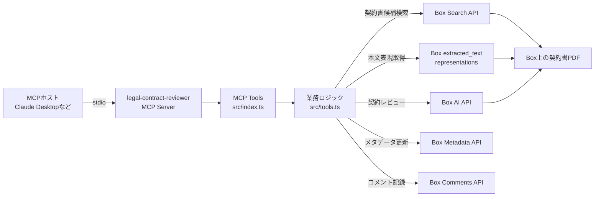
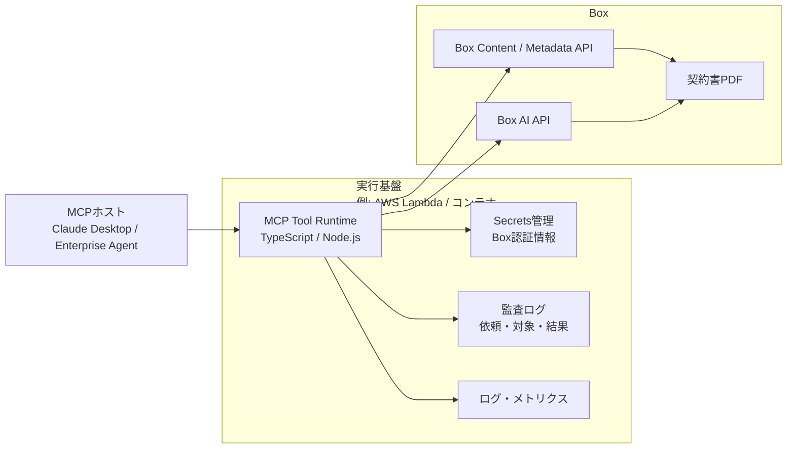

# legal-contract-reviewer

契約書レビュー業務を対象とした、Box AI APIオーケストレーション用MCPサーバーです。
現時点では、日本語契約書レビューを主なユースケースとしています。
ただし、設計自体は日本語の契約書だけに限定していません。Box AIが本文を扱える範囲で、英語など他言語の契約書レビューにも拡張できます。

Box上の契約書PDFを検索し、Box AIで契約リスクをレビューし、重大度、懸念点、推奨アクション、出典を返します。
Box公式MCPやBox AI APIを置き換えるものではなく、その上に業務特化の契約レビュー機能を載せるリファレンス実装です。

本プロジェクトはポートフォリオ兼リファレンス実装であり、Box公式製品ではありません。

## 目的

Boxには汎用MCPサーバーとBox AI APIがあります。
一方、実務で必要になるのは、単なるAPI呼び出しではなく、契約レビューという業務プロセスに沿ったツールです。

このMCPサーバーは、次のような業務レイヤーを提供します。

- 契約書レビューに特化したプロンプト
- 受託者、委託者というレビュー立場の切り替え
- 会社名や契約種別からの契約書検索
- 契約書本文に基づくリスク評価
- 重大度順の懸念点整理
- 推奨アクションの提示
- Box AI citationsによる出典提示
- ガバナンス確認、メタデータ反映、コメント記録への拡張

## 導入メリット

- ユーザーはBox file IDやAPI仕様を意識せず、自然文で契約レビューを依頼できる
- 契約書を別システムへコピーせず、Box上の既存ファイルをそのままレビュー対象にできる
- 契約書本文のAIレビューをBox AIで行い、外部LLMへの本文送信を避けられる
- MCPホストが契約書検索、レビュー、抽出、ガバナンス確認、メタデータ反映を組み合わせられる
- レビュー結果をBox Metadataやコメントに戻すことで、AI回答を業務記録として残せる
- 汎用APIではなく、契約レビュー業務に沿ったツールとして利用できる

## 全体設計



MCPホストはユーザーの自然文依頼を解釈し、必要なMCPツールを選択します。
このサーバーは、Box APIとBox AI APIを呼び出し、契約レビュー業務に必要な結果を返します。

## 主なMCPツール

| ツール | 内容 |
|------|------|
| `box_find_contracts` | 会社名や契約種別などの自然文から、Box上の契約書PDF候補を検索 |
| `box_review_contract` | 契約書を法務観点でレビューし、懸念点、重大度、推奨アクション、出典を返す |
| `box_extract_contract` | 契約相手方、期間、自動更新、解約予告、金額、準拠法などを構造化抽出 |
| `box_governance_scan` | PIIや機密情報の可能性を検出し、リスクバンドに集約 |
| `box_writeback_metadata` | 抽出・判定結果をBox Metadataへ書き戻す |
| `box_post_summary_comment` | レビュー要約をBoxファイルのコメントとして残す |
| `box_ai_ask` | Box内ファイルを根拠に、出典付きで質問応答 |

## 契約レビュー機能

中心となるツールは `box_review_contract` です。

入力として、次のいずれかで契約書を指定できます。

- `contractQuery`: 会社名や契約種別を含む自然文
- `boxUrl`: BoxファイルURL
- `fileName`: PDFファイル名
- `fileId`: Box file ID

`contractQuery` を使うと、ユーザーはBox file IDを知らなくても契約書を指定できます。

例：

```text
グローバルコマースとの業務委託契約
```

レビュー立場は次の2つです。

- `受託者`
- `委託者`

レビュー観点：

- 一方的に不利な条項
- 解約・中途解約の条件
- 自動更新の妥当性
- 損害賠償の上限・範囲
- 秘密保持の範囲と期間
- 知的財産権の帰属
- 準拠法・管轄
- 曖昧で解釈が割れる表現

出力には、総評、懸念点、重大度、推奨アクション、Box AI citationsを含みます。

## 契約書検索の設計

`box_find_contracts` と `contractQuery` は、自然文で対象契約書を探すための機能です。

検索は2段階で行います。

```text
1. Box Search APIで候補PDFを取得
2. 候補PDFの extracted_text を取得し、検索語をすべて含むものだけに絞り込み
```

Box Search APIでは、ファイル名だけでなく本文も検索対象にします。

```text
contentTypes: ["name", "file_content"]
```

その後、`extracted_text` を使って表記ゆれを吸収します。
例えば、本文に `グローバル・コマース` と書かれていて、ユーザーが `グローバルコマース` と入力した場合でも、ローカル側の正規化で同一視できます。

検索対象フォルダは `BOX_SEARCH_FOLDER_ID` で限定できます。
本番では、契約書フォルダや法務部門フォルダに限定する前提です。

## データ境界

このサーバーは、契約書本文を外部LLMに送る設計ではありません。

```text
契約書PDF: Boxに保存
契約書本文のAIレビュー: Box AI API
MCPサーバー: 検索語、ファイルID、レビュー結果、出典スニペットを処理
MCPホスト: ユーザーとの対話、ツール選択、結果表示
```

正確には、レビュー結果や出典スニペットはMCPサーバーとMCPホストに返ります。
そのため「データが一切Box外に出ない」ではなく、「契約書本文を外部LLMに渡さず、Box AIとBox権限を軸に処理する」が設計上の主張です。

## 認証と権限

Box認証は `src/box.ts` に集約しています。

対応する認証方式：

- Developer Token
- Client Credentials Grant（CCG）

CCGでは次のどちらかで動作します。

- `BOX_ENTERPRISE_ID`: サービスアカウントとして動作
- `BOX_USER_ID`: as-user構成

PoCではサービスアカウント運用を想定しています。
本番では、依頼者本人のBox権限に沿って検索・レビューできるas-user構成が理想です。

## ガバナンス機能

`box_governance_scan` は、Boxの `extracted_text` 表現を取得し、正規表現ベースでPIIや機密情報らしき文字列を検出します。

現状はPoC実装です。
本番では、企業の情報分類ポリシー、DLPルール、Box Governance設計に合わせてルール化します。

## メタデータ・コメント連携

契約レビューや抽出結果は、Box上に戻すことを想定しています。

- `box_writeback_metadata`
  - Box Metadata Templateに抽出結果やリスク分類を書き戻す
- `box_post_summary_comment`
  - Boxファイル上にレビュー要約をコメントとして残す

これにより、AIレビュー結果を一過性の回答で終わらせず、Box上の監査・運用文脈に戻せます。

## 本番運用の考え方

本番では、MCPツール実行層を社内の実行基盤に配置し、認証情報管理、監査ログ、監視、権限制御を整えます。
AWSに載せる場合は、Lambdaやコンテナ実行基盤、Secrets Manager、DynamoDB、CloudWatchなどを組み合わせる構成が考えられます。

重要なのは、クラウド基盤を主役にすることではなく、契約書本文のレビューをBox AIに寄せ、Boxの権限と監査の文脈で運用することです。



本番設計で重視する点：

- Box認証情報はSecrets Managerなどの秘密情報管理サービスで管理
- 実行ロールやサービスアカウントは最小権限
- 監査ログには契約書本文を保存しない
- 監査ログは依頼者、対象ファイル、実行時刻、ステータス、処理時間を中心に保存
- 必要に応じてネットワーク経路や外向き通信を制御する
- 契約書本文を外部LLMへ渡す場合は、顧客のセキュリティ要件に基づき別途設計する

## セットアップ

### 1. 環境変数

```bash
cp .env.template .env
```

Developer Tokenで動かす場合：

```bash
BOX_DEV_TOKEN=
```

CCGで動かす場合：

```bash
BOX_CLIENT_ID=
BOX_CLIENT_SECRET=
BOX_ENTERPRISE_ID=
```

検索対象フォルダを限定する場合：

```bash
BOX_SEARCH_FOLDER_ID=
```

### 2. ビルド

```bash
npm install
npm run build
```

### 3. MCPサーバー起動

```bash
npm start
```

Claude DesktopなどのMCPホストから使う場合は、`dist/index.js` をMCP設定に登録します。

```json
{
  "mcpServers": {
    "legal-contract-reviewer": {
      "command": "node",
      "args": ["/ABSOLUTE/PATH/TO/legal-contract-reviewer/dist/index.js"],
      "env": {
        "BOX_ENV_PATH": "/ABSOLUTE/PATH/TO/legal-contract-reviewer/.env"
      }
    }
  }
}
```

## 既知の制約

- 無料Box Developer環境ではas-userが使えない場合があるため、PoCではCCGのサービスアカウント運用
- `box_governance_scan` のPII検出は正規表現ベース
- `box_writeback_metadata` はBox Metadata Templateの事前作成が前提
- Box Searchは表記ゆれに影響されるため、必要に応じてメタデータ検索や別名辞書を組み合わせる
- MCPホストに返るレビュー結果と出典スニペットはBox外に出るため、AIホスト側の利用・保存ポリシー設計が必要

## 技術スタック

- TypeScript
- Node.js
- `@modelcontextprotocol/sdk`
- `box-typescript-sdk-gen`
- `zod`
- Box AI API
- Box Content API
- Box Metadata API
