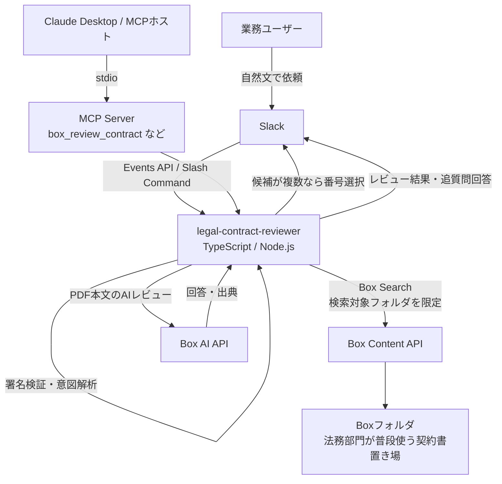
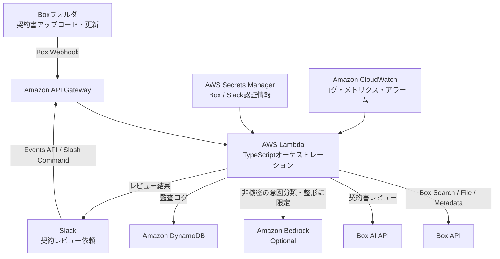

# legal-contract-reviewer

> デモ画像プレースホルダ：Slackで `@契約レビューBot グローバルコマースとの業務委託契約、受託者側で危ない記載はある？` と依頼し、候補選択から契約リスクレビューが返る画面を掲載予定。

**Box AI API** を使い、日本語契約書を法務観点でレビューする **MCPサーバー + Slack App**。
Box公式MCPやBox AI APIを置き換えるものではなく、その上に乗る「業務特化のソリューション層」として実装したリファレンスです。

本プロジェクトはポートフォリオ兼リファレンス実装であり、Box公式製品ではありません。

## ねらい

Boxは、汎用MCPサーバーと強力なBox AI APIをすでに提供しています。
一方、エンタープライズ顧客が実務で必要とするのは、契約レビュー、リスク分類、監査証跡、メタデータ反映といった業務プロセスに沿った体験です。

このプロジェクトでは、契約書本文を外部LLMに渡さず、契約レビューのAI処理をBox AIで行います。
日本のエンタープライズ利用を想定し、個人情報・秘密情報・契約リスクを扱う前提で、ガバナンスを重視しています。

厳密には、Slackに表示するレビュー結果、出典スニペット、検索語、ファイル名はBox外のオーケストレーション層やSlackに渡ります。
そのため本プロジェクトの主張は「データが一切Box外に出ない」ではなく、「契約書本文を外部LLMに渡さず、Box AIとBox権限を軸にレビューする」です。

## デモ体験

ユーザーはMCPツール名やBox file IDを意識しません。
実運用に近い見せ方として、Slack Appから自然文で依頼できます。
ローカルだけで確認したい場合は、Slack風デモUIも用意しています。

```text
グローバルコマースとの業務委託契約、受託者側で危ない記載はある？
```

```text
ネクサスとの契約、委託者側でリスクになりそうなところを見て
```

```text
このBox URLの契約書を、受託者側でレビューして
```

内部では `box_review_contract` が呼ばれ、Box URLやファイル名があれば直接レビューし、曖昧な自然文であればBox Searchで候補を提示します。
同じ契約書でも、委託者・受託者の立場を変えてレビューできます。

自然文検索の動き：

- 検索対象は `BOX_SEARCH_FOLDER_ID` で指定したBoxフォルダ配下に限定
- Box Searchで候補を取得
- PDF本文を正規化して、入力語をすべて含む候補だけに絞り込み
- 候補が1件ならそのままレビュー開始
- 複数候補ならSlackスレッドで番号選択
- レビュー後の同じスレッドでは、追加質問を同じPDFへの追質問として扱う

例：

```text
@契約レビューBot グローバルコマースとの業務委託契約、受託者側で危ない記載はある？
```

```text
第一条からいこう
```

2つ目の発言は新しい契約書検索ではなく、直前にレビューしたPDFの第1条に関する追加確認として処理されます。

### Slack App連携

Slack Appを作成し、Botからこのサーバーのエンドポイントへリクエストを送ります。

必要な環境変数：

```bash
SLACK_BOT_TOKEN=
SLACK_SIGNING_SECRET=
BOX_CLIENT_ID=
BOX_CLIENT_SECRET=
BOX_ENTERPRISE_ID=
BOX_SEARCH_FOLDER_ID=
```

`BOX_SEARCH_FOLDER_ID` は任意ですが、デモでは設定推奨です。
法務部門が普段使うBoxフォルダをBotに共有し、そのフォルダIDを指定すると、候補検索をその配下に限定できます。
Bot専用フォルダへ契約書をコピーする運用ではなく、通常のBoxフォルダをそのまま使う想定です。

起動：

```bash
npm run build
npm run start:slack
```

Slack App側の設定：

- Event Subscriptions
  - Request URL: `https://<公開URL>/slack/events`
  - Subscribe to bot events:
    - `app_mention`
    - `message.channels`
    - `message.im`
- Slash Commands
  - Command: `/contract-review`
  - Request URL: `https://<公開URL>/slack/commands`
- OAuth Scopes
  - `app_mentions:read`
  - `chat:write`
  - `channels:history`
  - `im:history`

`message.channels` と `channels:history` は、候補表示後にスレッドで `1` や `2` だけ返信した内容をBotが受け取るために必要です。
スコープやイベントを追加した後は、Slack Appをワークスペースに再インストールしてください。

ローカルで動かす場合は、ngrokやCloudflare Tunnelなどで `http://localhost:3000` を一時公開します。
Slackからのリクエストは `SLACK_SIGNING_SECRET` で検証します。

Slackでの依頼例：

```text
@契約レビューBot グローバルコマースとの業務委託契約、受託者側で危ない記載はある？
```

```text
@契約レビューBot ネクサスとの契約、委託者側でリスクになりそうなところを見て
```

Box URLやPDF名が文中に無い場合、Botは自然文から検索語を作り、Box Searchで候補を探します。
`BOX_SEARCH_FOLDER_ID` が設定されている場合は、そのBoxフォルダ配下だけを検索します。
候補が複数ある場合は番号で選択します。

```text
候補が2件見つかりました。どの契約書をレビューしますか？

1. sample_risky_contract.pdf
2. ...

このスレッドで番号だけ返信してください。例: 1
```

### Slack風デモUI（ローカル確認用）

```bash
npm run build
BOX_ENV_PATH=/path/to/.env npm run demo:slack
```

ブラウザで `http://localhost:4173` を開きます。
UIだけSlack風にしており、裏側では本物のBox AI APIを呼び出します。
Slack App設定を作る前の確認に使います。

## 主な機能

| ツール | 内容 | 使うBox機能 |
|------|------|-----------|
| `box_review_contract` | 日本語契約書を法務観点でレビュー。重大度順の懸念点、推奨アクション、出典を返す | Box AI `/ai/ask` |
| `box_extract_contract` | 契約相手方、期間、自動更新、解約予告、金額、準拠法などを構造化抽出 | Box AI `/ai/extract_structured` |
| `box_governance_scan` | PII・機密情報を検出し、リスクバンドに集約 | Boxテキスト表現 + ポリシールール |
| `box_writeback_metadata` | 抽出・判定結果をエンタープライズメタデータとして書き戻し | Box Metadata API |
| `box_post_summary_comment` | レビュー要約をBoxファイルのコメントとして残す | Box Comments API |
| `box_ai_ask` | Box内のファイルを根拠に、出典付きで質問応答 | Box AI `/ai/ask` |

エージェントで連結すると、次の流れをBox内で完結できます。

```text
契約取り込み → 契約レビュー → ガバナンス確認 → メタデータ反映 → コメント記録
```

## アーキテクチャ

詳細は [`docs/ARCHITECTURE.md`](docs/ARCHITECTURE.md) を参照。



### 実行場所

現在のデモでは、TypeScript/Node.jsサーバーはローカルPC上で動きます。
SlackからのリクエストはCloudflare Tunnelなどで一時的にローカルへ転送します。

本番化する場合は、同じTypeScript/Node.js処理をAWS Lambda、ECS、Cloud Runなどに配置します。
AWSやクラウドはSlackイベントの受付、ジョブ制御、ログ、キャッシュなどの実行基盤として使い、契約書本文のAIレビューはBox AIに寄せる設計です。

```text
Slack
  ↓
AWS Lambda / ECS / Cloud Run
  ↓
TypeScript / Node.js オーケストレーション層
  ↓
Box Search / Box AI / Box Metadata
```

### AWS本番リファレンス

PoCではローカルPC上でSlack AppとMCPサーバーを動かしています。
実顧客に展開する場合は、同じTypeScriptの業務ロジックをAWS上のサーバーレス構成に載せ替える想定です。



本番化で重視する点：

- Box認証情報とSlackシークレットはAWS Secrets Managerで管理
- Lambda実行ロールはIAM最小権限で設計
- 必要に応じてVPC内のプライベートサブネットで実行
- DynamoDBにレビュー依頼、対象ファイル、実行結果、エラーを監査ログとして保存
- CloudWatchで実行ログ、遅延、失敗率を監視
- 契約書本文のレビューはBox AIを基本とし、Bedrockを使う場合は非機密な意図分類や文面整形に限定

面接での説明ポイント：

```text
PoCではSlackとBox AIをつないだ自然文レビュー体験を実装しています。
本番運用ではAWS Lambda/API Gatewayに載せ、Secrets Manager、IAM最小権限、DynamoDB監査ログ、CloudWatch監視を組み合わせます。
契約書本文のAIレビューはBox AIで行い、AWSは実行基盤と監査・運用のレイヤーとして使います。
```

### データ境界

| データ | 扱う場所 |
|------|---------|
| 契約書PDF本体 | Box |
| 契約書本文のAIレビュー | Box AI |
| 検索語、ファイルID、ファイル名 | Node.jsサーバー |
| レビュー結果、出典スニペット | Node.jsサーバー、Slack |
| Slackメッセージ | Slack |

契約書本文をBedrockなどの外部LLMへ渡す設計にはしていません。
Bedrockを使う場合でも、意図分類や非機密な制御処理に限定する方針です。

### パフォーマンス方針

現在のSlack検索は次の順序で動きます。

```text
Box Search → 上位候補を取得 → PDF本文を取得 → 入力語をすべて含む候補だけ残す
```

全PDFを総当たりするのではなく、Box Searchの上位候補に対して本文照合します。
ただし、対象フォルダや候補数が大きくなると遅くなる可能性があります。

本番化では以下を優先します。

- `BOX_SEARCH_FOLDER_ID` で検索対象を業務フォルダに限定
- 候補数を少なく保つ
- 契約相手方、契約種別、締結日などをBox Metadata化
- メタデータ検索を優先し、本文検索は補助にする
- PDF本文や検索結果の短時間キャッシュを検討

## セットアップ

### 1. Boxアプリを作成

1. Box Developer Consoleを開く
2. Custom Appを作成
3. 認証方式を選択
   - 簡易デモ：Developer Token
   - 継続利用：Client Credentials Grant（CCG）
4. 必要なスコープを有効化
   - ファイル読み取り
   - Box AI
   - メタデータ
   - コメント

### 2. 認証情報を設定

短時間のデモはDeveloper Tokenで動かせます。

```bash
cp .env.template .env
# .env に BOX_DEV_TOKEN を設定
```

CCGで動かす場合は、`.env` に次を設定します。

```bash
BOX_CLIENT_ID=
BOX_CLIENT_SECRET=
BOX_ENTERPRISE_ID=
```

`BOX_ENTERPRISE_ID` を使う場合、MCPサーバーはサービスアカウントとして動作します。
そのため、サービスアカウントが所有または参照できるBoxファイルだけをレビューできます。

ユーザー代理で実行したい場合は `BOX_USER_ID` を使います。
ただし、無料のBox Developer環境では as-user が `invalid_grant` になる場合があります。
有料のEnterprise環境では、管理者承認とアプリ設定によりas-user構成を取れます。

### 3. ビルドと起動

```bash
npm install
npm run build
npm start
```

### 4. Claude Desktopに接続

`claude_desktop_config.example.json` を参考に、Claude DesktopのMCP設定へ `dist/index.js` の絶対パスを登録します。
設定後、Claude Desktopを再起動します。

例：

```text
Boxの sample_risky_contract.pdf を受託者の立場でレビューして
```

MCP Inspectorでも確認できます。

```bash
npx @modelcontextprotocol/inspector node dist/index.js
```

## デモ用ファイル

脆弱な条項を意図的に含む `sample_risky_contract.pdf` を、通常のBox画面で見える共有フォルダへ配置します。
Bot専用フォルダに契約書をコピーするのではなく、業務ユーザーが普段使うBoxフォルダをサービスアカウントに共有する想定です。

`.env` の `BOX_SEARCH_FOLDER_ID` にそのフォルダIDを設定すると、Slack連携ではそのフォルダ配下だけを検索します。

デモ例：

```text
@契約レビューBot グローバルコマースとの業務委託契約、受託者側で危ない記載はある？
```

```text
候補が出たら、このスレッドで `1` と返信
```

## セキュリティとガバナンス

- 契約書本文はこのMCPサーバーに保存しません
- 契約書本文のAIレビューはBox AI APIを通じて実行します
- 契約書本文を外部LLMへ送信しません
- Slackに投稿されるレビュー結果や出典スニペットはBox外に出るため、投稿先チャンネルの権限設計が必要です
- `.env` は `.gitignore` 済みで、リポジトリへコミットしません
- Developer Tokenは60分で失効するため、デモ用途です
- CCGではサービスアカウントの権限範囲がそのまま参照可能範囲になります
- 実運用ではas-user構成により、依頼者本人のBox権限に沿った検索・レビューにするのが理想です
- `box_governance_scan` のPII検出はPoC実装です。本番では企業の分類ポリシーに合わせてルール化します

## 技術スタック

- TypeScript
- `box-typescript-sdk-gen`
- `@modelcontextprotocol/sdk`
- `zod`
- Box AI API
- Box Content API
- Box Metadata API
