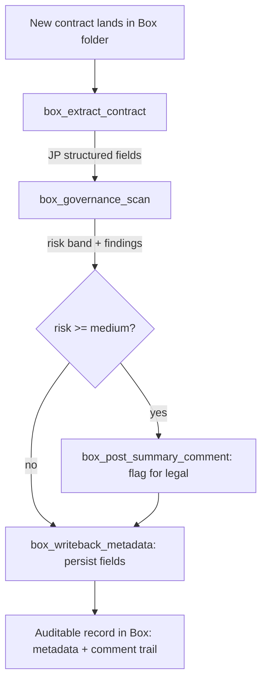

# Architecture & design rationale

## The solution-architect framing
Box's native platform already covers a lot: a generic MCP server (remote + self-hosted), Box AI for
Q&A and extraction, metadata, and comments. A *solution architect's* job starts where those primitives
stop being enough for a specific customer — typically a regulated enterprise that needs the AI output
to be **governed, structured, and auditable**, not just generated.

This project is deliberately scoped as that layer. It does not re-implement what Box ships; it
**composes** Box primitives into a workflow a customer would pay for.

## Flow: contract intake → review → govern

## Why each Box primitive
- **`/ai/ask` with citations** — grounding + provenance. Enterprises will not accept ungrounded answers
  on legal/financial content; citations make the answer defensible.
- **`/ai/extract_structured`** — turns an unstructured PDF into a typed record. JP-aware fields matter
  for the Japan market specifically.
- **Metadata write-back** — the structured result becomes queryable, retainable, and policy-governable
  inside Box (retention, classification, search), not trapped in a chat log.
- **Comments** — keeps the human review trail attached to the content, where reviewers already work.

## Auth & non-functional concerns
- Developer Token for demo; **CCG (service account)** for anything beyond a demo — least-privilege,
  auto-refreshing, no human in the loop.
- Governance rules are policy-driven inputs, not code. In a real engagement they map to the customer's
  classification scheme (ISMS / 個人情報保護法 / Pマーク).
- The server is stateless and persists no document content.

## How I'd extend this for a real customer
1. Replace ad-hoc fields with a customer **metadata template** and drive extraction from it.
2. Trigger on Box **events/webhooks** (folder watch) instead of manual calls.
3. Add a **human-in-the-loop** approval step before metadata is committed for high-risk items.
4. Swap the local regex governance for **Box Shield** classification + the AI scan as a second signal.
5. Pin Box AI to a specific model version for output stability in downstream systems.
